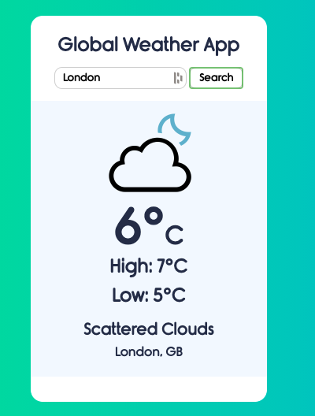

# Global-Weather-App

This is an basic Global Weather App that uses Geolocation API 
and OpenWeatherMap API to display weather data or cities around the world

  

Credit for Icons and Font Files goes to Code Explained
